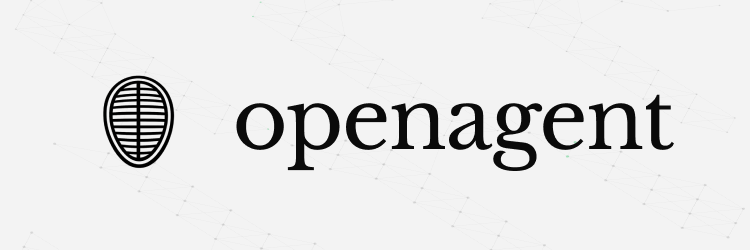
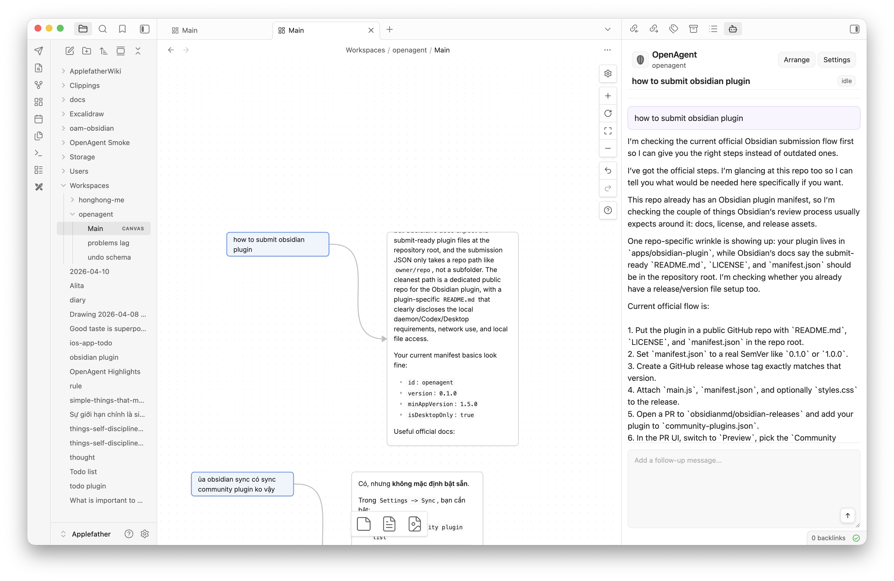

<p align="center">
  
</p>

# OpenAgent

OpenAgent turns Obsidian Canvas into a local workspace for Codex.

Pick nodes on a canvas, turn them into a task, keep nearby context visible, and write the result back into the graph.


## How It Works

1. Select one or more nodes on a Canvas.
2. Run `OpenAgent: New thread from selection`.
3. OpenAgent sends the selection and nearby markdown context to Codex.
4. Progress streams into Obsidian and the result is written back to the graph.

## Quick Start

Requirements:

- macOS
- Node.js 20+
- `pnpm`
- Codex Desktop
- Obsidian Desktop

Recommended setup path: use the bootstrap skill from this repo.

1. Install the Codex skill:

```text
Install the Codex skill from:
https://github.com/openagentmarket/openagent/tree/main/skills/openagent-canvas-bootstrap
```

2. Restart Codex so it picks up the skill.

3. Open the repo you want to use with Codex.
4. Make sure your Obsidian vault is already open.
5. Start a new Codex thread and paste:

```text
Use the openagent-canvas-bootstrap skill to set up OpenAgent for this repo.
```

The bootstrap flow reuses your current vault by default, enables the `OpenAgent` plugin, starts the local runtime, and creates `Workspaces/<repo-name>/Main.canvas`.

To update the installed skill and local OpenAgent checkout later, start a new Codex thread and paste:

```text
Use the openagent-canvas-bootstrap skill to update OpenAgent on this machine.
```

## License

Released under the [MIT License](LICENSE).
